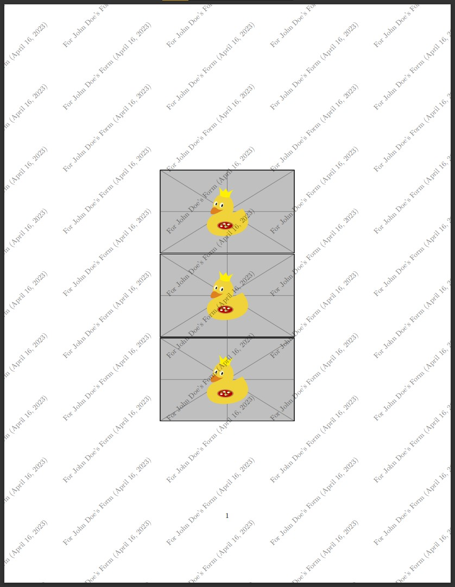

# $\LaTeX$ Tiling Watermark for Image

This repository contains a LaTeX template that adds a tiling watermark to any image document that contains sensitive information (ID card, KTP, Kartu Keluarga, etc.) The watermark can help prevent criminal activities when the document is printed and not destroyed properly. The watermark can also indicate the owner and the intended recipient of the document, and how they should handle it.

## Features

- The template uses the `tikz` package to create a tiling watermark on every page of the document.
- The watermark can be customized by changing the text, font, color, opacity, angle, and scale.
- The watermark can also be replaced by an image or a logo
- The template supports any image format that is compatible with LaTeX, such as PNG, JPG, PDF, etc.

## Usage

To use this template, follow these steps:

1. Clone this repository or download the ZIP file.
2. Open the `main.tex` file in your preferred LaTeX editor or compiler.
3. Modify the lines inside the `figure` environment to add your own images:

```
\includegraphics{example-image-duck}\\ %path to image
\includegraphics{example-image-duck}\\ %path to image
\includegraphics{example-image-duck}\\ %path to image
```

4. Compile the `main.tex` file and view the output PDF file.

Replace `example-image-duck` with your own image or logo file name and adjust the width as needed.

## Contribution

If you find any bugs or have any suggestions for improvement, please feel free to open an issue or a pull request on GitHub. Your feedback is welcome and appreciated.🙏

## Preview

